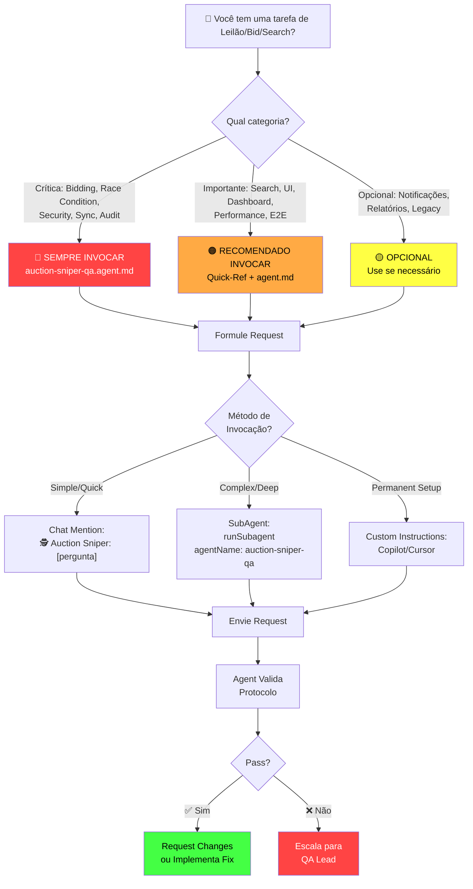
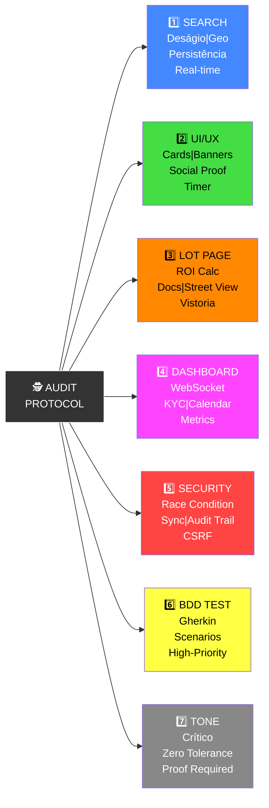
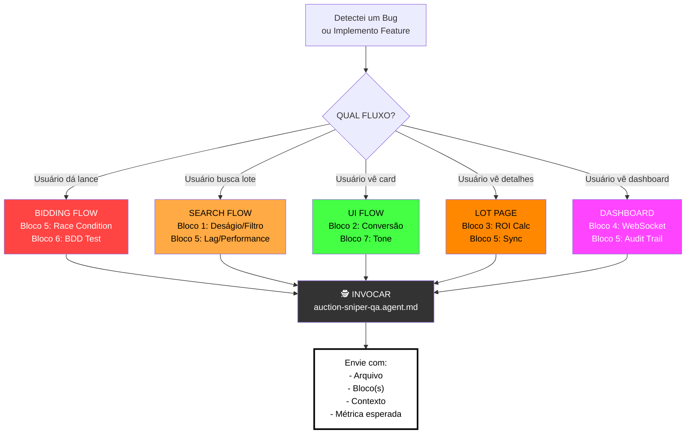

# 🕵️ Auction Sniper & QA - Visual Cheat Sheet

**Ultra-Quick Reference** | **Diagrams** | **Decision Trees**

---

## 🎯 Agent Invocation Flow



---

## 📋 7-Bloco Protocol Map



---

## 🚀 Request Formulation Tree

```
┌─ 🕵️ Auction Sniper Mode [ATIVADO]
├─ Seu Caso:
│  ├─ Search/Filtro Bug? → Bloco 1 + 5
│  ├─ Card/UI Feio? → Bloco 2 + 7
│  ├─ Página Lote Lenta? → Bloco 3 + 5
│  ├─ Dashboard quebrado? → Bloco 4 + 5
│  ├─ Race Condition? → Bloco 5 + 6 (CRÍTICO)
│  ├─ Escrever E2E test? → Bloco 6
│  └─ Code Review? → Blocos 1-6 (full)
│
├─ Protocolo de Blocos: [Escolha acima]
├─ Critério: [Descreva o problema]
├─ Arquivo: [src/components/...]
├─ Stack Trace: [Cole aqui se houver erro]
│
└─ Envie! 🚀
```

---

## ⚡ Priority Matrix (What to Check First)

```
CRITICIDADE vs FREQUÊNCIA

High Freq    ┌─────────────────────────────────┐
             │ BDD Testing (Bloco 6)           │ ← Daily validation
             │ Security Checks (Bloco 5)       │ ← Every PR
             ├─────────────────────────────────┤
             │ UI/UX Review (Bloco 2)          │ ← During design
             │ Performance (Bloco 4)           │ ← Before deploy
             ├─────────────────────────────────┤
             │ Search Filters (Bloco 1)        │
             │ Lot Page (Bloco 3)              │
Low Freq     └─────────────────────────────────┘
             Low Impact          High Business
```

---

## 📊 Decision Tree: "O que validar?"



---

## ✅ Pre-Deployment Checklist (5 Minutes)

```
Antes de fazer Deploy de Feature de Leilão:

🕵️ SECURITY (Bloco 5) ← CRITICAL
  ☐ Double-click shield ativo
  ☐ Audit log 100% (IP, device, timestamp)
  ☐ CSRF token presente
  ☐ Rate limiting OK (< 100 req/min)
  ☐ TimeStamp sync < 100ms
  ☐ Zero SQL injection risk
  
🔍 FUNCTIONALITY (Blocos 1-4) ← HIGH
  ☐ Cálculo de deságio 100% preciso
  ☐ Filtros persistem entre páginas
  ☐ UI/UX consistent (colores, fonts)
  ☐ ROI calc matches fórmula
  ☐ WebSocket < 500ms latency
  
🧪 TESTING (Bloco 6) ← REQUIRED
  ☐ BDD Gherkin scenarios cobertos
  ☐ E2E Playwright tests pass
  ☐ Performance test OK (< 2s bid latency)
  ☐ Edge cases testados (timeout, edital change)
  
🎯 UX (Bloco 2 + 7) ← IMPORTANT
  ☐ Mobile viewport OK (375px)
  ☐ Accessibility WCAG AA
  ☐ Tone matches brand (crítico, não casual)
  ☐ Error messages user-friendly

✅ APPROVED FOR DEPLOY
```

---

## 🎤 Tone Guide (Seu Agent vai Falar Assim)

```
❌ NUNCA vai dizer:
  - "Parece correto"
  - "Depois a gente melhora"
  - "Aproximadamente na 80%"
  - "Achômetro UI"
  - "Sem comentários"

✅ SEMPRE vai dizer:
  - "Stack trace: [específico]"
  - "Sincronização: < 100ms ou fail"
  - "Race condition: [prova com timing]"
  - "Audit log: [campos esperados]"
  - "Teste: [Gherkin scenario]"
  - "Métrica esperada: [KPI]"

🎯 Personality:
  - Crítico (sem meios tons)
  - Técnico (sem sugarcoat)
  - Exigente (prova > achômetro)
  - Obcecado por: ROI, segurança, sincronização
```

---

## 🔗 File Navigation

```
Você está aqui: auction-sniper-qa.CHEATSHEET.md

Quer saber:
├─ "Como invocar?" → Vá para: auction-sniper-qa.USAGE.md
├─ "Qual protocolo?" → Vá para: auction-sniper-qa.agent.md (Blocos 1-6)
├─ "Quick ref?" → Vá para: auction-sniper-qa.quick-reference.md
├─ "Índice de files?" → Vá para: auction-sniper-qa.INDEX.md (este!)
├─ "Global agents list?" → Vá para: AGENTS.md (raiz)
└─ "Master rules?" → Vá para: .github/copilot-instructions.md
```

---

## 📈 Metrics Dashboard (Target Values)

```
┌─ PERFORMANCE
│  ├─ Bid latency: < 2 segundos ✅
│  ├─ UI response: < 300ms ✅
│  ├─ Search update: < 1s ✅
│  └─ WebSocket lag: < 500ms ✅
│
├─ RELIABILITY
│  ├─ Audit log coverage: 100% ✅
│  ├─ Race condition: 0 occurrences ✅
│  ├─ Double-bid: 0 cases ✅
│  └─ Session timeout: < 5min inactivity ✅
│
├─ QA
│  ├─ Test coverage: > 85% ✅
│  ├─ BDD scenarios: critical paths ✅
│  ├─ Accessibility: WCAG AA 100% ✅
│  └─ Performance score: > 80 ✅
│
└─ DX (Developer Experience)
   ├─ Code review time: < 2h ✅
   ├─ Onboarding: < 30min ✅
   ├─ Bug resolution: < 4h (critical) ✅
   └─ Documentation: up-to-date ✅
```

---

## 🚨 Critical Paths (Sempre Validar)

```
    USER FLOW                  SA-QA VALIDATION
    
    ┌── Acessa Leilão  ──→   [Bloco 1] Search load OK?
    │                         [Bloco 5] Session secure?
    │
    ├── Vê Card Lote   ──→   [Bloco 2] UI conversion OK?
    │                         [Bloco 7] Tone de urgência?
    │
    ├── Analysa ROI    ──→   [Bloco 3] Calc 100% preciso?
    │                         [Bloco 5] Performance < 500ms?
    │
    └── Dá Lance       ──→   [Bloco 5] Race condition locked?
                              [Bloco 6] Audit trail logged?
                              [Bloco 6] BDD scenario passed?
```

---

**Last Update**: 7/02/2026 | **Version**: 1.0.0 | **Status**: ✅ Ready
