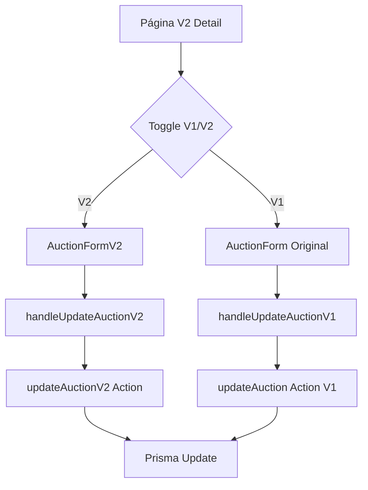

# BidExpert Leilões V2 - Documentação

> Documentação completa do módulo de leilões V2, incluindo arquitetura, componentes e guia de uso.

## 📋 Índice

1. [Visão Geral](#visão-geral)
2. [Arquitetura](#arquitetura)
3. [Componentes](#componentes)
4. [Guia de Uso](#guia-de-uso)
5. [API e Actions](#api-e-actions)
6. [Diferenças V1 vs V2](#diferenças-v1-vs-v2)

---

## Visão Geral

O módulo **Auctions V2** é uma implementação independente do CRUD de leilões, projetado para coexistir com a versão anterior (V1). A principal característica é o **toggle visível** que permite alternar entre os formulários V1 e V2 na mesma página de edição.

### Funcionalidades Principais

- **Toggle de Versão**: Botões V1/V2 visíveis acima da página para alternar entre versões
- **Formulário V2 Independente**: Novo formulário com validação Zod própria
- **Grid de Lotes**: Visualização e gerenciamento de lotes do leilão
- **Histórico de Auditoria**: Log de alterações (sem aba de Analytics)
- **Ações Independentes**: Server actions separadas para V2

---

## Arquitetura

### Estrutura de Diretórios

```
src/app/admin/auctions-v2/
├── page.tsx                      # Listagem de leilões V2
├── actions.ts                    # Server actions V2
├── [auctionId]/
│   └── page.tsx                  # Página de detalhe/edição com toggle V1/V2
└── components/
    ├── auction-form-v2.tsx       # Formulário V2 com Zod
    ├── auction-lots-grid.tsx     # Grid de lotes
    └── auction-audit-grid.tsx    # Histórico de auditoria
```

### Fluxo de Dados



---

## Componentes

### 1. AuctionDetailPageV2 (`[auctionId]/page.tsx`)

Componente principal da página de detalhe/edição.

**Props e Estado**:
```typescript
type FormVariant = 'v1' | 'v2';

interface PageDependencies {
  auctioneers: AuctioneerProfileInfo[];
  sellers: SellerProfileInfo[];
  states: StateInfo[];
  allCities: CityInfo[];
  categories: LotCategory[];
  judicialProcesses: JudicialProcess[];
}
```

**Tabs Disponíveis**:
- `form`: Formulário de edição (V1 ou V2)
- `lots`: Grid de lotes
- `audit`: Histórico de alterações

### 2. AuctionFormV2 (`components/auction-form-v2.tsx`)

Formulário independente com validação Zod.

**Props**:
```typescript
interface AuctionFormV2Props {
  initialData?: Auction | null;
  auctioneers: AuctioneerProfileInfo[];
  sellers: SellerProfileInfo[];
  states: StateInfo[];
  allCities: CityInfo[];
  categories: LotCategory[];
  judicialProcesses: JudicialProcess[];
  isEditing?: boolean;
  onSubmit: (data: Partial<AuctionFormData>) => Promise<{ success: boolean; message: string }>;
}
```

**Schema de Validação** (Zod):
```typescript
const auctionFormV2Schema = z.object({
  title: z.string().min(3, 'Título deve ter no mínimo 3 caracteres'),
  description: z.string().optional().nullable(),
  status: z.nativeEnum(AuctionStatus).optional(),
  auctionType: z.nativeEnum(AuctionType).optional(),
  categoryId: z.string().optional().nullable(),
  auctioneerId: z.string().optional().nullable(),
  sellerId: z.string().optional().nullable(),
  judicialProcessId: z.string().optional().nullable(),
  stateId: z.string().optional().nullable(),
  cityId: z.string().optional().nullable(),
  zipCode: z.string().optional().nullable(),
  street: z.string().optional().nullable(),
  complement: z.string().optional().nullable(),
  neighborhood: z.string().optional().nullable(),
  auctionStages: z.array(/* ... */),
  // ... outros campos
});
```

### 3. AuctionLotsGrid (`components/auction-lots-grid.tsx`)

Grid para visualização e gerenciamento de lotes.

**Props**:
```typescript
interface AuctionLotsGridProps {
  auctionId: string;
  onAddLot?: () => void;
}
```

### 4. AuctionAuditGrid (`components/auction-audit-grid.tsx`)

Histórico de alterações do leilão.

**Props**:
```typescript
interface AuctionAuditGridProps {
  auctionId: string;
}
```

---

## Guia de Uso

### Acessando a Página V2

1. Navegue para `/admin/auctions-v2`
2. Clique em um leilão para abrir a página de detalhe
3. Use os botões **V1** / **V2** acima das tabs para alternar entre versões

### Alterando a Versão do Formulário

```
┌─────────────────────────────────────────────────────┐
│ Versão do formulário:  [V2]  [V1]                   │
├─────────────────────────────────────────────────────┤
│ ┌─────────────┬─────────┬───────────┐               │
│ │ Dados Leilão│  Lotes  │ Histórico │               │
│ └─────────────┴─────────┴───────────┘               │
│                                                     │
│  [Formulário V1 ou V2 conforme seleção]             │
│                                                     │
└─────────────────────────────────────────────────────┘
```

### Editando um Leilão

1. Selecione a versão desejada (V1 ou V2)
2. Preencha os campos do formulário
3. Clique em **Salvar**
4. Uma notificação confirmará a operação

### Gerenciando Lotes

1. Acesse a tab **Lotes**
2. Use o botão **Adicionar Lote** para criar novos
3. Clique em um lote para editar

### Visualizando Histórico

1. Acesse a tab **Histórico**
2. Veja todas as alterações realizadas no leilão

---

## API e Actions

### Server Actions V2 (`actions.ts`)

```typescript
// Buscar leilão
export async function getAuctionV2(auctionId: string): Promise<Auction | null>

// Atualizar leilão
export async function updateAuctionV2(
  auctionId: string,
  data: Partial<AuctionFormData>
): Promise<{ success: boolean; message: string }>

// Criar leilão
export async function createAuctionV2(
  data: AuctionFormData
): Promise<{ success: boolean; message: string; auctionId?: string }>

// Excluir leilão
export async function deleteAuctionV2(
  auctionId: string
): Promise<{ success: boolean; message: string }>

// Listar leilões
export async function getAuctionsV2(): Promise<Auction[]>
```

### Handlers na Página

```typescript
// Handler para V1
const handleUpdateAuctionV1 = async (data: Partial<AuctionFormValues>) => {
  const result = await updateAuction(auctionId, data);
  // ...
};

// Handler para V2
const handleUpdateAuctionV2 = async (data: Partial<AuctionFormData>) => {
  const result = await updateAuctionV2(auctionId, data);
  // ...
};
```

---

## Diferenças V1 vs V2

| Aspecto | V1 | V2 |
|---------|----|----|
| **Validação** | React Hook Form padrão | Zod Schema |
| **Actions** | `updateAuction` | `updateAuctionV2` |
| **Componente** | `AuctionForm` | `AuctionFormV2` |
| **Stages** | useFieldArray manual | useFieldArray com Zod |
| **EntitySelector** | Props originais | Props normalizadas |
| **Analytics Tab** | Incluída | Removida |

### Campos Principais Compartilhados

- `title`, `description`
- `status`, `auctionType`
- `categoryId`, `auctioneerId`, `sellerId`
- `judicialProcessId`
- `stateId`, `cityId`, `zipCode`
- `street`, `complement`, `neighborhood`
- `auctionStages[]`

---

## Pré-requisitos

- Node.js 18+
- Next.js 14.2+
- Prisma Client gerado (`npx prisma generate`)
- Servidor rodando (`npm run dev`)

## Comandos Úteis

```bash
# Gerar cliente Prisma
npx prisma generate

# Iniciar servidor de desenvolvimento
npm run dev

# Typecheck
npm run typecheck

# Build de produção
npm run build
```

---

## Suporte

Para dúvidas ou problemas, consulte:
- `REGRAS_NEGOCIO_CONSOLIDADO.md` - Regras de negócio
- `AI_PROJECT_RULES.md` - Regras do projeto
- `.github/copilot-instructions.md` - Instruções do assistente AI

---

*Documentação atualizada em: 2025*
