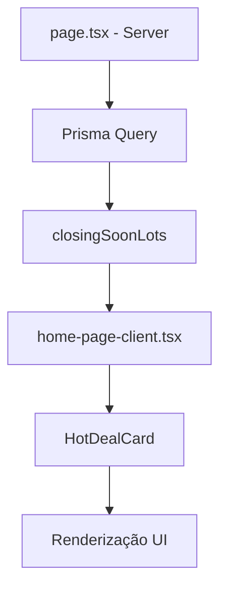

# Hot Deal Card - Documentação da Feature

## Visão Geral

O componente **HotDealCard** exibe lotes em destaque ("Hot Deals") na página inicial, destacando oportunidades com encerramento próximo conforme parâmetros gerais da plataforma.

## Arquitetura

### Arquivos Envolvidos

- **`src/components/hot-deal-card.tsx`** - Componente principal do Hot Deal
- **`src/app/home-page-client.tsx`** - Integração na página inicial
- **`src/app/page.tsx`** - Server-side data fetching dos lotes com encerramento próximo

### Fluxo de Dados



## Funcionalidades

### 1. Galeria de Imagens
- Imagem principal com zoom ao hover
- Thumbnails verticais para navegação entre imagens
- Suporte a múltiplas imagens por lote
- Fallback para placeholder quando sem imagem

### 2. Countdown Timer
- Timer em tempo real (dias, horas, minutos, segundos)
- Atualização a cada segundo
- Baseado no campo `endDate` do lote

### 3. Badge de Economia
- Calcula desconto automaticamente: `(evaluationValue - price) / evaluationValue`
- Exibe percentual de economia
- Visível apenas quando há desconto real

### 4. Carrossel de Lotes
- Navegação entre múltiplos lotes hot deal
- Auto-play configurável (padrão: 10 segundos)
- Indicador de posição atual

### 5. Barra de Progresso
- Mostra engajamento baseado em quantidade de lances
- Progresso visual com percentage bar

### 6. Informações do Lote
- Título com link para detalhes
- Preço atual e valor de avaliação (riscado)
- Status do lote (Aberto para Lances, etc.)
- Tipo de leilão (Judicial/Extrajudicial)
- Nome do comitente/vendedor
- Rating visual (estrelas)
- Quantidade de lances

## Props do Componente

```typescript
interface HotDealCardProps {
  lots: Lot[];                    // Lista de lotes hot deal
  auctions: Auction[];            // Leilões para associação
  platformSettings: PlatformSettings;  // Configurações da plataforma
  title?: string;                 // Título da seção (default: "Oferta Imperdível de Hoje")
  autoPlay?: boolean;             // Auto-play do carrossel (default: true)
  autoPlayInterval?: number;      // Intervalo em ms (default: 8000)
}
```

## Critérios de Seleção de Lotes

Os lotes exibidos no HotDealCard são selecionados pelo server-side em `page.tsx`:

1. **Status**: `ABERTO_PARA_LANCES`
2. **Período**: Encerramento dentro de 7 dias
3. **Ordenação**: Por data de encerramento mais próxima
4. **Limite**: Primeiros 5 lotes após filtro

## Integração com Parâmetros Gerais

O componente pode ser configurado através de `PlatformSettings`:

- `defaultUrgencyTimerHours`: Define o limite de horas para considerar urgente
- `showCountdownOnCards`: Controla exibição do countdown

## Responsividade

- **Desktop (lg+)**: Layout horizontal com galeria à esquerda
- **Tablet/Mobile**: Layout empilhado vertical
- Thumbnails ocultos em telas pequenas (< sm)

## Acessibilidade

- Labels ARIA para botões de navegação
- `data-testid` para todos os elementos interativos
- Navegação por teclado nos thumbnails
- Alt text em todas as imagens

## Testes

Ver arquivo `tests/e2e/hot-deal-card.spec.ts` para testes Playwright.

## Changelog

### v1.0.0 (2025-12-26)
- Implementação inicial do HotDealCard
- Galeria com thumbnails verticais
- Countdown timer em tempo real
- Carrossel auto-play
- Badge de economia
- Barra de progresso de lances
- Integração na homepage (classic variant)
