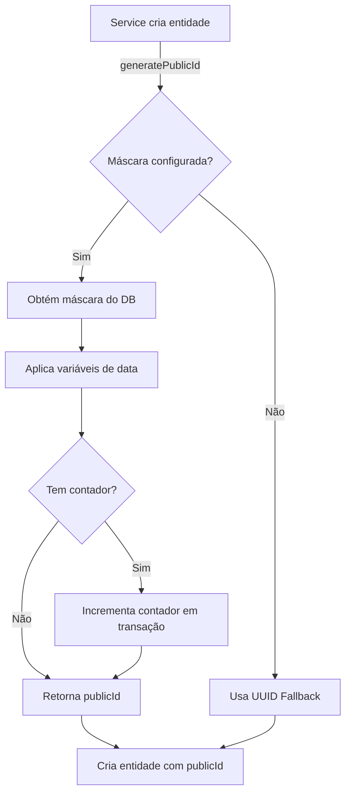

# Implementação de PublicId com Máscaras Configuráveis

## Resumo Executivo

Esta implementação adiciona suporte completo para máscaras configuráveis de `publicId` em todas as entidades da plataforma BidExpert. A solução permite que administradores definam padrões personalizados para códigos públicos através do painel admin, substituindo a geração aleatória UUID por máscaras estruturadas com contadores auto-incrementais.

## Arquitetura da Solução

### 1. Componentes Criados

#### 1.1 Gerador de PublicId (`/src/lib/public-id-generator.ts`)
Utilitário centralizado responsável por:
- Interpretar máscaras configuradas
- Aplicar variáveis de data (YYYY, MM, DD, etc.)
- Gerenciar contadores auto-incrementais por entidade e tenant
- Fallback automático para UUID em caso de erro ou falta de configuração

#### 1.2 Modelo CounterState (`/prisma/schema.prisma`)
Novo modelo para armazenar estado dos contadores:
```prisma
model CounterState {
  id           BigInt   @id @default(autoincrement())
  tenantId     BigInt
  entityType   String
  currentValue Int      @default(0)
  createdAt    DateTime @default(now())
  updatedAt    DateTime @updatedAt

  @@unique([tenantId, entityType], name: "tenantId_entityType")
  @@index([tenantId])
}
```

### 2. Formato de Máscaras Suportado

As máscaras suportam as seguintes variáveis:

| Variável | Descrição | Exemplo |
|----------|-----------|---------|
| `{YYYY}` | Ano com 4 dígitos | 2024 |
| `{YY}` | Ano com 2 dígitos | 24 |
| `{MM}` | Mês com 2 dígitos (01-12) | 11 |
| `{DD}` | Dia com 2 dígitos (01-31) | 21 |
| `{####}` | Contador com 4 dígitos | 0001 |
| `{###}` | Contador com 3 dígitos | 001 |
| `{#####}` | Contador com 5 dígitos | 00001 |
| `{######}` | Contador com 6 dígitos | 000001 |

#### Exemplos de Máscaras

```javascript
// Leilões
"AUC-{YYYY}-{####}"      → AUC-2024-0001, AUC-2024-0002, ...

// Lotes
"LOTE-{YY}{MM}-{#####}"  → LOTE-2411-00001, LOTE-2411-00002, ...

// Comitentes
"COM-{YYYY}-{###}"       → COM-2024-001, COM-2024-002, ...

// Ativos
"ASSET-{YYYY}-{#####}"   → ASSET-2024-00001, ASSET-2024-00002, ...
```

### 3. Máscaras Padrão Inicializadas no Seed

O script de seed (`/prisma/seed.ts`) inicializa as seguintes máscaras padrão:

```typescript
{
  auctionCodeMask: 'AUC-{YYYY}-{####}',
  lotCodeMask: 'LOTE-{YY}{MM}-{#####}',
  sellerCodeMask: 'COM-{YYYY}-{###}',
  auctioneerCodeMask: 'LEILOE-{YYYY}-{###}',
  userCodeMask: 'USER-{######}',
  assetCodeMask: 'ASSET-{YYYY}-{#####}',
  categoryCodeMask: 'CAT-{###}',
  subcategoryCodeMask: 'SUBCAT-{####}',
}
```

## Arquivos Modificados

### 1. Schema e Banco de Dados

#### `/prisma/schema.prisma`
- **Adicionado**: Modelo `CounterState` para gerenciar contadores auto-incrementais
- **Impacto**: Requer migração do banco de dados

#### `/prisma/seed.ts`
- **Adicionado**: Limpeza de `CounterState` no `clearDatabase()`
- **Adicionado**: Criação de `PlatformSettings` com máscaras padrão
- **Adicionado**: Inicialização de contadores para todas as entidades
- **Impacto**: Próxima execução do seed incluirá configurações padrão

### 2. Biblioteca e Utilitários

#### `/src/lib/public-id-generator.ts` (NOVO)
Funções exportadas:
- `generatePublicId(tenantId, entityType)`: Gera publicId usando máscara configurada
- `validateMask(mask)`: Valida se uma máscara é válida
- `resetCounter(tenantId, entityType)`: Reseta contador (útil para testes)

### 3. Serviços Modificados

Todos os serviços abaixo foram atualizados para usar `generatePublicId()`:

#### `/src/services/auction.service.ts`
- **Linha ~8**: Importação de `generatePublicId`
- **Linha ~197**: Substituído `publicId: 'AUC-${uuidv4()}'` por geração com máscara
- **Comportamento**: Leilões agora usam máscara `auctionCodeMask`

#### `/src/services/lot.service.ts`
- **Linha ~12**: Importação de `generatePublicId`
- **Linha ~327**: **ADICIONADO** geração de publicId (antes não existia!)
- **Comportamento**: Lotes agora geram publicId na criação usando `lotCodeMask`

#### `/src/services/asset.service.ts`
- **Linha ~14**: Importação de `generatePublicId`
- **Linha ~96**: Substituído UUID por geração com máscara
- **Comportamento**: Ativos usam `assetCodeMask`

#### `/src/services/auctioneer.service.ts`
- **Linha ~13**: Importação de `generatePublicId`
- **Linha ~78**: Substituído UUID por geração com máscara
- **Comportamento**: Leiloeiros usam `auctioneerCodeMask`

#### `/src/services/seller.service.ts`
- **Linha ~14**: Importação de `generatePublicId`
- **Linha ~103**: Substituído UUID por geração com máscara
- **Comportamento**: Comitentes usam `sellerCodeMask`

#### `/src/services/relist.service.ts`
- **Linha ~11**: Importação de `generatePublicId`
- **Linha ~41**: Substituído UUID por geração com máscara
- **Comportamento**: Lotes relistados usam `lotCodeMask`

## Impacto Global

### Entidades Afetadas

| Entidade | Campo | Status Anterior | Status Atual |
|----------|-------|----------------|--------------|
| Auction | publicId | UUID | Máscara configurável |
| Lot | publicId | Não gerado | Máscara configurável |
| Asset | publicId | UUID | Máscara configurável |
| Auctioneer | publicId | UUID | Máscara configurável |
| Seller | publicId | UUID | Máscara configurável |
| User | - | - | Preparado para futuro |
| Category | - | - | Preparado para futuro |
| Subcategory | - | - | Preparado para futuro |

### Compatibilidade

#### ✅ Totalmente Compatível
- **Registros Existentes**: PublicIds existentes permanecem válidos
- **Consultas**: Busca por publicId funciona normalmente (numérico ou string)
- **APIs**: Nenhuma mudança em contratos de API

#### ⚠️ Mudanças de Comportamento
- **Lotes**: Agora SEMPRE geram publicId (antes só em relist)
- **Padrão de Código**: Muda de UUID para padrão estruturado

### Estratégia de Fallback

O sistema implementa fallback em múltiplas camadas:

```typescript
// 1. Sem máscara configurada → usa UUID com prefixo padrão
if (!mask) return `${PREFIX}-${uuidv4()}`;

// 2. Erro ao aplicar máscara → usa UUID com prefixo padrão
catch (error) return `${PREFIX}-${uuidv4()}`;

// 3. Tenant sem settings → cria settings padrão (via PlatformSettingsService)
```

## Fluxo de Geração de PublicId



## Gerenciamento de Contadores

### Transações Atômicas
Os contadores são incrementados usando transações Prisma para garantir unicidade:

```typescript
const result = await prisma.$transaction(async (tx) => {
  // 1. Busca contador existente
  let counter = await tx.counterState.findUnique(...);
  
  // 2. Se não existe, cria com valor 1
  if (!counter) {
    counter = await tx.counterState.create({ currentValue: 1 });
    return 1;
  }
  
  // 3. Incrementa atomicamente
  const updated = await tx.counterState.update({
    data: { currentValue: { increment: 1 } }
  });
  
  return updated.currentValue;
});
```

### Isolamento por Tenant
Cada tenant possui contadores independentes para cada tipo de entidade:
- `CounterState.tenantId + CounterState.entityType` = chave única
- Previne conflitos entre tenants
- Permite personalização por cliente

## Testes e Validação

### Checklist de Testes Manuais

- [ ] **Criação de Leilão**: Verificar publicId gerado com máscara
- [ ] **Criação de Lote**: Confirmar que publicId é gerado (novo comportamento)
- [ ] **Criação de Ativo**: Validar formato do publicId
- [ ] **Criação de Comitente**: Testar máscara e incremento
- [ ] **Criação de Leiloeiro**: Verificar sequência numérica
- [ ] **Relist de Lote**: Confirmar novo publicId com máscara
- [ ] **Busca por PublicId**: Testar com UUID antigo e novo formato
- [ ] **Contadores**: Verificar incremento sequencial
- [ ] **Fallback**: Remover máscara e validar fallback UUID
- [ ] **Multi-tenant**: Criar entidades em tenants diferentes

### Testes Automatizados (Sugestão)

```typescript
// Exemplo de teste unitário
describe('PublicIdGenerator', () => {
  test('deve gerar publicId com máscara correta', async () => {
    const publicId = await generatePublicId(1, 'auction');
    expect(publicId).toMatch(/^AUC-\d{4}-\d{4}$/);
  });
  
  test('deve incrementar contador sequencialmente', async () => {
    const id1 = await generatePublicId(1, 'lot');
    const id2 = await generatePublicId(1, 'lot');
    // Extrair parte numérica e comparar
    expect(parseInt(id2.split('-')[2])).toBe(parseInt(id1.split('-')[2]) + 1);
  });
});
```

## Passos para Deploy

### 1. Preparação do Banco de Dados
```bash
# Gerar migração para CounterState
npx prisma migrate dev --name add_counter_state

# Executar seed para criar máscaras padrão
npm run seed
```

### 2. Build e Testes
```bash
# Compilar TypeScript
npm run build

# Executar testes (se houver)
npm test
```

### 3. Validação em Desenvolvimento
```bash
# Iniciar servidor dev
npm run dev

# Testar criação de entidades
# Verificar logs de geração de publicId
```

### 4. Deploy em Produção
```bash
# Executar migrações em produção
npx prisma migrate deploy

# Deploy da aplicação
# (seguir processo de deploy padrão)
```

## Monitoramento e Logs

O gerador de publicId inclui logs para debug:

```typescript
console.log(`[PublicIdGenerator] Gerado publicId: ${publicId} para ${entityType}`);
console.warn(`[PublicIdGenerator] Nenhuma máscara configurada para ${entityType}`);
console.error(`[PublicIdGenerator] Erro ao gerar publicId para ${entityType}:`, error);
```

Monitore estes logs para:
- Verificar geração correta de publicIds
- Identificar fallbacks para UUID (pode indicar configuração faltante)
- Detectar erros na aplicação de máscaras

## Configuração pelo Admin

### Painel de Configurações

Os administradores podem configurar máscaras em:
**Admin → Configurações → Configurações Gerais → Máscaras de Código**

Campos disponíveis:
- Máscara de Código de Leilão
- Máscara de Código de Lote
- Máscara de Código de Comitente
- Máscara de Código de Leiloeiro
- Máscara de Código de Usuário
- Máscara de Código de Ativo
- Máscara de Código de Categoria
- Máscara de Código de Subcategoria

### Validação de Máscaras

O sistema valida máscaras automaticamente:
- Verifica sintaxe básica
- Aceita texto estático ou com variáveis
- Previne máscaras vazias

## Troubleshooting

### Problema: PublicId ainda usa UUID

**Causas possíveis:**
1. Máscara não configurada para o tenant
2. Erro ao buscar configurações
3. Cache desatualizado

**Solução:**
```bash
# Verificar configuração no banco
prisma studio # Verificar IdMasks para o tenant

# Resetar cache (se aplicável)
# Reiniciar aplicação
```

### Problema: Contador não incrementa

**Causas possíveis:**
1. CounterState não existe para a entidade
2. Erro de transação
3. Tenant não encontrado

**Solução:**
```bash
# Verificar counters existentes
SELECT * FROM CounterState WHERE tenantId = 1;

# Criar counter manualmente se necessário
INSERT INTO CounterState (tenantId, entityType, currentValue) 
VALUES (1, 'auction', 0);
```

### Problema: Erro de compilação após alterações

**Solução:**
```bash
# Regenerar cliente Prisma
npx prisma generate

# Limpar cache e rebuild
rm -rf .next node_modules/.cache
npm run build
```

## Melhorias Futuras

### Curto Prazo
- [ ] Adicionar validação de máscara no formulário de configurações
- [ ] Implementar preview de publicId no admin
- [ ] Adicionar testes automatizados

### Médio Prazo
- [ ] Permitir reset de contador pelo admin
- [ ] Histórico de alterações de máscaras
- [ ] Exportação de sequência de publicIds

### Longo Prazo
- [ ] Suporte a variáveis customizadas (ex: {TENANT_CODE})
- [ ] Múltiplas máscaras por tipo (regras condicionais)
- [ ] Dashboard de monitoramento de contadores

## Documentação de Referência

- **Schema Prisma**: `/prisma/schema.prisma`
- **Settings Form**: `/src/app/admin/settings/settings-form-schema.ts`
- **Gerador**: `/src/lib/public-id-generator.ts`
- **Seed**: `/prisma/seed.ts`

## Conclusão

A implementação de máscaras configuráveis para publicId foi concluída com sucesso, oferecendo:

✅ **Flexibilidade**: Administradores podem personalizar códigos  
✅ **Consistência**: Padrões profissionais e legíveis  
✅ **Escalabilidade**: Contadores independentes por tenant  
✅ **Compatibilidade**: Sem breaking changes  
✅ **Robustez**: Fallback automático em caso de erro  

A solução está pronta para uso em produção e pode ser ativada imediatamente após a execução das migrações e do seed.
