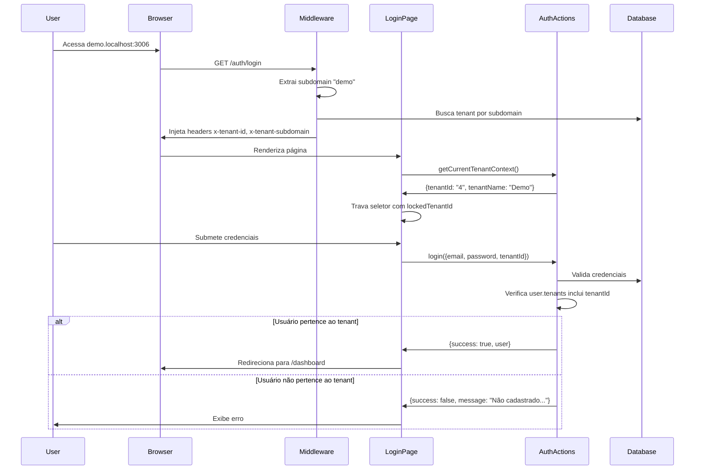

# Acesso Direto via Subdomínio do Tenant (Multi-Tenant Subdomain Access)

## Visão Geral

Esta funcionalidade implementa o acesso direto ao tenant via subdomínio. Quando um usuário acessa a aplicação através de um subdomínio específico (ex: `demo.localhost:3000` ou `demo.bidexpert.com.br`), o sistema automaticamente:

1. **Identifica o Tenant** pelo subdomínio
2. **Bloqueia o seletor de workspace** na tela de login
3. **Valida que o usuário pertence ao tenant** durante o login
4. **Isola a sessão** (cookies não compartilhados entre subdomínios)

## Arquivos Modificados

### 1. `src/middleware.ts`
- Adicionada lógica para suportar subdomínios em `localhost` (ex: `demo.localhost:3000`)
- Redireciona domínio raiz para CRM em produção
- Injecta headers `x-tenant-id` e `x-tenant-subdomain` para uso server-side

### 2. `src/server/lib/session.ts`
- `getCookieDomain()` agora retorna `undefined` para isolamento estrito
- Cookies de sessão são específicos por subdomínio (não compartilhados)

### 3. `src/app/auth/login/page.tsx`
- Novo state `lockedTenantId` e `lockedTenantName` para travar seletor
- Chama `getCurrentTenantContext()` no mount para detectar subdomínio
- Exibe ícone de cadeado e mensagem quando tenant está travado
- Desabilita o Select de workspace quando acessado via subdomínio

### 4. `src/app/auth/actions.ts`
- Nova função `getCurrentTenantContext()` para obter info do tenant atual
- Função `login()` valida que usuário pertence ao tenant do subdomínio
- Função `getDevUsers()` filtra usuários pelo tenant do contexto atual
- Re-exporta `getSession()` para compatibilidade com outros módulos

### 5. `scripts/seed-db.ts`
- Criados tenants: **CRM** (id: 3, subdomain: `crm`) e **Demo** (id: 4, subdomain: `demo`)
- Usuários de demonstração: `demo.admin@bidexpert.com.br` e `demo.user@bidexpert.com.br`

## Como Testar

### Ambiente de Desenvolvimento

1. **Configurar Hosts File** (opcional para DNS local):
   ```
   127.0.0.1 demo.localhost
   127.0.0.1 crm.localhost
   ```

2. **Acessar via subdomínio**:
   - `http://demo.localhost:3006/auth/login` → Tenant "Ambiente Demonstração"
   - `http://crm.localhost:3006/auth/login` → Tenant "CRM BidExpert"

3. **Verificar comportamento**:
   - Seletor de workspace deve estar travado com ícone de cadeado
   - Mensagem "Você está acessando: [Nome do Tenant]" aparece
   - Tentar login com usuário de outro tenant deve falhar

### Usuários de Teste

| Email | Senha | Tenant | Role |
|-------|-------|--------|------|
| demo.admin@bidexpert.com.br | demo@123 | Demo | Admin |
| demo.user@bidexpert.com.br | demo@123 | Demo | User |
| admin@bidexpert.com.br | Admin@123 | Landlord | SystemAdmin |

## Fluxo de Autenticação



## Configuração de Produção

### DNS
Configure os subdomínios para apontar para o servidor:
```
demo.bidexpert.com.br -> IP do servidor
crm.bidexpert.com.br -> IP do servidor
*.bidexpert.com.br -> IP do servidor (wildcard)
```

### SSL
Configure certificados wildcard ou individual para cada subdomínio.

## Comportamento Especial

1. **Landlord (ID: 1)**: Acesso ao domínio principal sem subdomínio, vê todos os tenants
2. **Subdomínio específico**: Acesso restrito apenas ao tenant do subdomínio
3. **Cookie isolation**: Cada subdomínio tem sua própria sessão
4. **Dev auto-login**: Filtra usuários pelo tenant atual

## Mensagens de Erro

| Cenário | Mensagem (PT-BR) |
|---------|------------------|
| Usuário não pertence ao tenant | "Usuário não cadastrado neste Espaço de Trabalho. Verifique o endereço ou registre-se." |
| Credenciais inválidas | "Credenciais inválidas." |
| Tenant não encontrado | "Espaço de Trabalho não encontrado." |

## Rollback

Para reverter esta funcionalidade:
1. Remover `lockedTenantId` logic do `login/page.tsx`
2. Remover validação de tenant do `login()` em `actions.ts`
3. Restaurar `getCookieDomain()` para retornar domínio raiz
4. Remover regex de localhost do middleware

---

**Implementado em**: Julho 2025  
**Autor**: GitHub Copilot  
**Versão**: 1.0.0
