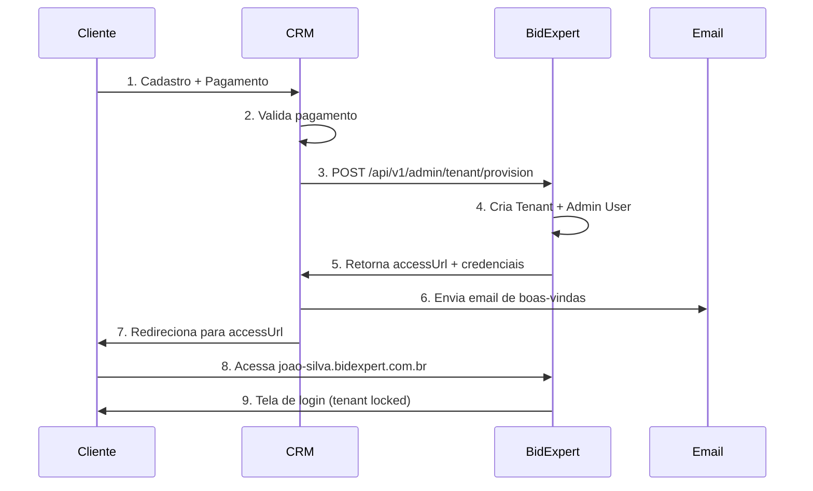

# BidExpert CRM Integration API - Guia de Integração

## Visão Geral

Este documento descreve como o sistema CRM BidExpert deve integrar-se com a plataforma de leilões para:
1. **Provisionar novos tenants** (Espaços de Trabalho)
2. **Criar usuário administrador** automaticamente
3. **Redirecionar o cliente** para seu novo subdomínio

---

## Autenticação

Todas as chamadas à API de administração requerem autenticação via **API Key**.

```http
Authorization: Bearer YOUR_ADMIN_API_KEY
Content-Type: application/json
```

> ⚠️ **IMPORTANTE**: A `ADMIN_API_KEY` deve ser configurada como variável de ambiente no servidor BidExpert e compartilhada de forma segura com o CRM.

### Variável de Ambiente (BidExpert Server)
```env
ADMIN_API_KEY=sua_chave_secreta_aqui
```

---

## Endpoints Disponíveis

### 1. Provisionar Novo Tenant + Admin User

**Endpoint**: `POST /api/v1/admin/tenant/provision`

Este é o endpoint principal que o CRM deve chamar após o cliente finalizar o cadastro e pagamento.

#### Request

```http
POST https://bidexpert.com.br/api/v1/admin/tenant/provision
Authorization: Bearer YOUR_ADMIN_API_KEY
Content-Type: application/json
```

```json
{
  "name": "Leiloeiro João Silva",
  "subdomain": "joao-silva",
  "resolutionStrategy": "SUBDOMAIN",
  "status": "TRIAL",
  "planId": "plan_basic",
  "maxUsers": 5,
  "maxStorageBytes": 5368709120,
  "maxAuctions": 50,
  "externalId": "crm_customer_12345",
  "webhookUrl": "https://crm.bidexpert.com.br/webhooks/tenant-events",
  "metadata": {
    "salesRep": "Maria Santos",
    "campaignId": "black_friday_2025"
  },
  "adminUser": {
    "email": "joao.silva@email.com",
    "fullName": "João Carlos Silva",
    "password": "SenhaSegura@2025",
    "cpf": "123.456.789-00",
    "phone": "(11) 99999-8888"
  },
  "branding": {
    "siteTitle": "Leilões João Silva",
    "siteTagline": "Os melhores leilões do mercado",
    "primaryColorHsl": "220 70% 50%"
  }
}
```

#### Campos do Request

| Campo | Tipo | Obrigatório | Descrição |
|-------|------|-------------|-----------|
| `name` | string | ✅ | Nome do tenant/empresa (min 3 caracteres) |
| `subdomain` | string | ✅ | Slug do subdomínio (ex: `joao-silva` → `joao-silva.bidexpert.com.br`) |
| `resolutionStrategy` | enum | ❌ | `SUBDOMAIN` (padrão), `PATH`, ou `CUSTOM_DOMAIN` |
| `customDomain` | string | ❌ | Domínio próprio (se `resolutionStrategy` = `CUSTOM_DOMAIN`) |
| `status` | enum | ❌ | `PENDING`, `TRIAL` (padrão), ou `ACTIVE` |
| `planId` | string | ❌ | ID do plano contratado no CRM |
| `maxUsers` | number | ❌ | Limite de usuários (padrão: 5) |
| `maxStorageBytes` | number | ❌ | Limite de storage em bytes (padrão: 1GB) |
| `maxAuctions` | number | ❌ | Limite de leilões simultâneos (padrão: 10) |
| `externalId` | string | ❌ | ID do cliente no CRM (para reconciliação) |
| `webhookUrl` | string | ❌ | URL para receber eventos do tenant |
| `metadata` | object | ❌ | Dados extras livres |
| `adminUser` | object | ✅ | Dados do usuário administrador |
| `adminUser.email` | string | ✅ | Email do admin (será o login) |
| `adminUser.fullName` | string | ✅ | Nome completo do admin |
| `adminUser.password` | string | ❌ | Senha (se não informada, gera automaticamente) |
| `adminUser.cpf` | string | ❌ | CPF do admin |
| `adminUser.phone` | string | ❌ | Telefone do admin |
| `branding` | object | ❌ | Configurações visuais iniciais |

#### Response (Sucesso - 201)

```json
{
  "success": true,
  "message": "Tenant provisionado com sucesso.",
  "data": {
    "tenant": {
      "id": "123",
      "name": "Leiloeiro João Silva",
      "subdomain": "joao-silva",
      "domain": null,
      "status": "TRIAL",
      "resolutionStrategy": "SUBDOMAIN",
      "apiKey": "tk_live_abc123xyz...",
      "trialExpiresAt": "2025-02-17T00:00:00.000Z",
      "customDomainVerifyToken": null
    },
    "adminUser": {
      "id": "456",
      "email": "joao.silva@email.com",
      "fullName": "João Carlos Silva",
      "isNewUser": true,
      "temporaryPassword": "SenhaSegura@2025"
    },
    "accessUrl": "https://joao-silva.bidexpert.com.br",
    "setupUrl": "https://joao-silva.bidexpert.com.br/tenant-setup",
    "status": "ready"
  }
}
```

#### Response (Erros)

**Subdomínio já existe (409):**
```json
{
  "success": false,
  "error": "SUBDOMAIN_EXISTS",
  "message": "O subdomínio 'joao-silva' já está em uso."
}
```

**Validação inválida (400):**
```json
{
  "success": false,
  "error": "VALIDATION_ERROR",
  "message": "Dados de provisionamento inválidos.",
  "details": {
    "formErrors": [],
    "fieldErrors": {
      "subdomain": ["Subdomínio pode conter apenas letras minúsculas, números e hífens."]
    }
  }
}
```

**API Key inválida (401):**
```json
{
  "success": false,
  "error": "UNAUTHORIZED",
  "message": "API Key inválida ou não fornecida."
}
```

---

## Fluxo de Integração Recomendado



---

## Exemplo de Código (CRM - Node.js/TypeScript)

```typescript
// crm-bidexpert-integration.ts

interface ProvisionTenantRequest {
  name: string;
  subdomain: string;
  adminUser: {
    email: string;
    fullName: string;
    password?: string;
  };
  status?: 'PENDING' | 'TRIAL' | 'ACTIVE';
  planId?: string;
  externalId?: string;
}

interface ProvisionTenantResponse {
  success: boolean;
  message: string;
  data?: {
    tenant: {
      id: string;
      subdomain: string;
      status: string;
      apiKey: string;
    };
    adminUser: {
      id: string;
      email: string;
      temporaryPassword: string | null;
    };
    accessUrl: string;
    setupUrl: string;
  };
  error?: string;
}

class BidExpertCRMIntegration {
  private apiBaseUrl: string;
  private adminApiKey: string;

  constructor() {
    this.apiBaseUrl = process.env.BIDEXPERT_API_URL || 'https://bidexpert.com.br';
    this.adminApiKey = process.env.BIDEXPERT_ADMIN_API_KEY || '';
  }

  /**
   * Provisiona um novo tenant no BidExpert e cria o usuário admin.
   * Retorna a URL de acesso para redirecionar o cliente.
   */
  async provisionTenant(data: ProvisionTenantRequest): Promise<ProvisionTenantResponse> {
    const response = await fetch(`${this.apiBaseUrl}/api/v1/admin/tenant/provision`, {
      method: 'POST',
      headers: {
        'Authorization': `Bearer ${this.adminApiKey}`,
        'Content-Type': 'application/json',
      },
      body: JSON.stringify(data),
    });

    const result = await response.json();

    if (!response.ok) {
      console.error('[CRM] Erro ao provisionar tenant:', result);
      throw new Error(result.message || 'Falha ao criar espaço de trabalho');
    }

    return result;
  }

  /**
   * Gera um slug válido a partir do nome do cliente.
   */
  generateSubdomain(companyName: string): string {
    return companyName
      .toLowerCase()
      .normalize('NFD')
      .replace(/[\u0300-\u036f]/g, '') // Remove acentos
      .replace(/[^a-z0-9]+/g, '-')      // Substitui caracteres especiais por hífen
      .replace(/^-+|-+$/g, '')          // Remove hífens no início/fim
      .substring(0, 50);                 // Limita a 50 caracteres
  }
}

// ============================================================================
// Uso no fluxo de checkout do CRM
// ============================================================================

async function handleCustomerCheckout(customer: {
  name: string;
  companyName: string;
  email: string;
  planId: string;
  crmCustomerId: string;
}) {
  const integration = new BidExpertCRMIntegration();

  try {
    // 1. Gera subdomínio a partir do nome da empresa
    const subdomain = integration.generateSubdomain(customer.companyName);

    // 2. Provisiona o tenant
    const result = await integration.provisionTenant({
      name: customer.companyName,
      subdomain,
      status: 'TRIAL', // Ou 'ACTIVE' se já pagou
      planId: customer.planId,
      externalId: customer.crmCustomerId,
      adminUser: {
        email: customer.email,
        fullName: customer.name,
        // Se não informar senha, BidExpert gera automaticamente
      },
    });

    if (result.success && result.data) {
      // 3. Salva no CRM
      await saveTenantInfoInCRM({
        customerId: customer.crmCustomerId,
        tenantId: result.data.tenant.id,
        subdomain: result.data.tenant.subdomain,
        accessUrl: result.data.accessUrl,
        apiKey: result.data.tenant.apiKey,
      });

      // 4. Envia email de boas-vindas
      await sendWelcomeEmail({
        to: customer.email,
        name: customer.name,
        accessUrl: result.data.accessUrl,
        temporaryPassword: result.data.adminUser.temporaryPassword,
      });

      // 5. Retorna URL para redirecionamento
      return {
        success: true,
        redirectUrl: result.data.accessUrl,
        setupUrl: result.data.setupUrl,
      };
    }

    throw new Error(result.message);

  } catch (error) {
    console.error('[CRM] Falha no checkout:', error);
    throw error;
  }
}
```

---

## Template de Email de Boas-Vindas

```html
<!DOCTYPE html>
<html>
<head>
  <meta charset="UTF-8">
  <title>Bem-vindo ao BidExpert!</title>
</head>
<body style="font-family: Arial, sans-serif; max-width: 600px; margin: 0 auto;">
  <h1 style="color: #2563eb;">🎉 Seu Espaço de Trabalho está pronto!</h1>
  
  <p>Olá, <strong>{{CUSTOMER_NAME}}</strong>!</p>
  
  <p>Seu espaço de trabalho no BidExpert foi criado com sucesso.</p>
  
  <div style="background: #f3f4f6; padding: 20px; border-radius: 8px; margin: 20px 0;">
    <h3 style="margin-top: 0;">📍 Seu Endereço Exclusivo:</h3>
    <p style="font-size: 18px;">
      <a href="{{ACCESS_URL}}" style="color: #2563eb; font-weight: bold;">
        {{ACCESS_URL}}
      </a>
    </p>
    
    <h3>🔐 Suas Credenciais:</h3>
    <p><strong>Email:</strong> {{EMAIL}}</p>
    <p><strong>Senha temporária:</strong> {{TEMPORARY_PASSWORD}}</p>
    
    <p style="color: #ef4444; font-size: 12px;">
      ⚠️ Recomendamos alterar sua senha no primeiro acesso.
    </p>
  </div>
  
  <a href="{{ACCESS_URL}}" 
     style="display: inline-block; background: #2563eb; color: white; 
            padding: 12px 24px; text-decoration: none; border-radius: 6px;
            font-weight: bold;">
    Acessar Minha Plataforma →
  </a>
  
  <hr style="margin: 30px 0; border: none; border-top: 1px solid #e5e7eb;">
  
  <p style="color: #6b7280; font-size: 12px;">
    Se você não solicitou esta conta, ignore este email.<br>
    © 2025 BidExpert - Plataforma de Leilões
  </p>
</body>
</html>
```

---

## Verificação de Subdomínio Disponível

Antes de chamar o endpoint de provisioning, o CRM pode verificar se o subdomínio está disponível:

### Endpoint: `GET /api/v1/admin/tenant/check-subdomain`

```http
GET https://bidexpert.com.br/api/v1/admin/tenant/check-subdomain?subdomain=joao-silva
Authorization: Bearer YOUR_ADMIN_API_KEY
```

**Response (Disponível):**
```json
{
  "available": true,
  "subdomain": "joao-silva",
  "suggestedUrl": "https://joao-silva.bidexpert.com.br"
}
```

**Response (Indisponível):**
```json
{
  "available": false,
  "subdomain": "joao-silva",
  "suggestions": ["joao-silva-leiloes", "joao-silva-2", "jcs-leiloes"]
}
```

---

## Webhooks (Eventos do Tenant)

Se você configurou `webhookUrl` no provisionamento, o BidExpert enviará eventos:

```json
{
  "event": "tenant.trial_expiring",
  "tenantId": "123",
  "subdomain": "joao-silva",
  "externalId": "crm_customer_12345",
  "data": {
    "trialExpiresAt": "2025-02-17T00:00:00.000Z",
    "daysRemaining": 3
  },
  "timestamp": "2025-02-14T10:30:00.000Z"
}
```

### Tipos de Eventos:
| Evento | Descrição |
|--------|-----------|
| `tenant.created` | Tenant criado com sucesso |
| `tenant.activated` | Trial convertido para ativo |
| `tenant.trial_expiring` | Trial expira em 3 dias |
| `tenant.trial_expired` | Trial expirou |
| `tenant.suspended` | Tenant suspenso por falta de pagamento |
| `tenant.deleted` | Tenant deletado |

---

## Checklist de Implementação para o CRM

- [ ] Configurar `BIDEXPERT_ADMIN_API_KEY` nas variáveis de ambiente
- [ ] Implementar função `generateSubdomain()` para criar slugs válidos
- [ ] Implementar chamada POST `/api/v1/admin/tenant/provision`
- [ ] Salvar `tenantId`, `subdomain` e `apiKey` no banco do CRM
- [ ] Configurar template de email de boas-vindas
- [ ] Implementar redirecionamento após checkout bem-sucedido
- [ ] (Opcional) Implementar verificação de subdomínio disponível
- [ ] (Opcional) Configurar recebimento de webhooks

---

## Ambientes

| Ambiente | URL Base | API Key Env Var |
|----------|----------|-----------------|
| Desenvolvimento | `http://localhost:3000` | `BIDEXPERT_ADMIN_API_KEY_DEV` |
| Homologação | `https://hml.bidexpert.com.br` | `BIDEXPERT_ADMIN_API_KEY_HML` |
| Produção | `https://bidexpert.com.br` | `BIDEXPERT_ADMIN_API_KEY_PROD` |

---

## Suporte

- **Documentação técnica**: Este documento
- **Contato técnico**: devteam@bidexpert.com.br
- **Logs de integração**: Disponíveis no painel admin do BidExpert

---

*Versão: 2.0.0 | Última atualização: Janeiro 2026*
