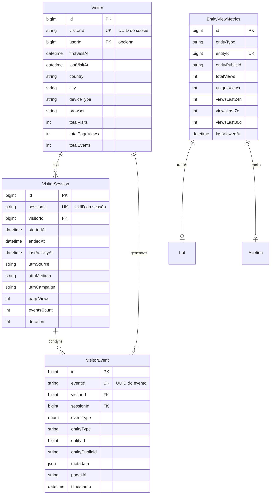

# Sistema de Rastreamento de Visitantes e Métricas de Visualização

## Visão Geral

Este documento descreve a implementação do sistema de rastreamento de visitantes do BidExpert, inspirado no modelo do Booking.com. O sistema permite registrar e contabilizar visualizações de lotes e leilões sem duplicar contagens para o mesmo visitante na mesma sessão.

## Arquitetura

### Modelo de Dados (Event Sourcing)



## Regras de Negócio

### 1. Identificação de Visitantes

**REGRA:** Visitantes são identificados por um UUID único armazenado em cookie (`bid_visitor_id`).

- O cookie tem validade de 1 ano
- Se o visitante estiver logado, o `userId` é associado ao registro do visitante
- O mesmo visitante pode ter múltiplos `userId` (se logar com diferentes contas)

### 2. Gerenciamento de Sessões

**REGRA:** Uma sessão agrupa eventos de uma visita específica. Após 30 minutos de inatividade, uma nova sessão é criada.

```
Timeout da sessão: 30 minutos (SESSION_TIMEOUT_MS = 30 * 60 * 1000)
```

- Cada sessão possui um UUID único
- A última atividade da sessão é atualizada a cada evento
- Sessões encerradas não são reativadas

### 3. Registro de Eventos (Event Sourcing)

**REGRA:** Cada interação do usuário é registrada como um evento imutável.

**Tipos de eventos disponíveis:**

| Tipo | Descrição |
|------|-----------|
| `PAGE_VIEW` | Visualização de página genérica |
| `LOT_VIEW` | Visualização de lote |
| `AUCTION_VIEW` | Visualização de leilão |
| `SEARCH` | Busca realizada |
| `FILTER_APPLIED` | Filtro aplicado |
| `BID_CLICK` | Clique em dar lance |
| `SHARE_CLICK` | Clique em compartilhar |
| `FAVORITE_ADD` | Adicionou aos favoritos |
| `FAVORITE_REMOVE` | Removeu dos favoritos |
| `DOCUMENT_DOWNLOAD` | Download de documento |
| `IMAGE_VIEW` | Visualização de imagem em galeria |
| `VIDEO_PLAY` | Reprodução de vídeo |
| `CONTACT_CLICK` | Clique em contato |
| `HABILITATION_START` | Início de habilitação |

### 4. Prevenção de Duplicatas

**REGRA CRÍTICA:** Não duplicar contagem do mesmo visitante na mesma sessão para a mesma entidade.

Para eventos `LOT_VIEW` e `AUCTION_VIEW`:
- Antes de registrar, verifica se já existe evento do mesmo tipo para a mesma entidade na sessão atual
- Se existir, retorna `isDuplicate: true` e não cria novo evento
- A contagem de visualizações só incrementa para visualizações únicas na sessão

### 5. Métricas Agregadas

**REGRA:** Métricas agregadas são mantidas para exibição rápida nos contadores.

**Campos mantidos em `EntityViewMetrics`:**

| Campo | Descrição |
|-------|-----------|
| `totalViews` | Total de visualizações (todas as vezes) |
| `uniqueViews` | Visitantes únicos |
| `viewsLast24h` | Views nas últimas 24 horas |
| `viewsLast7d` | Views nos últimos 7 dias |
| `viewsLast30d` | Views nos últimos 30 dias |

**Atualização:**
- `totalViews` é incrementado em tempo real a cada visualização
- `uniqueViews` e métricas por período devem ser recalculadas por um job periódico

### 6. Sincronização com Campo `views` do Lot

**REGRA:** O campo `views` no modelo `Lot` é atualizado automaticamente ao registrar um `LOT_VIEW`.

```typescript
await prisma.lot.update({
  where: { id: entityId },
  data: { views: { increment: 1 } }
});
```

## Componentes Implementados

### Backend

| Arquivo | Descrição |
|---------|-----------|
| `prisma/schema.prisma` | Modelos `Visitor`, `VisitorSession`, `VisitorEvent`, `EntityViewMetrics` e enum `VisitorEventType` |
| `src/services/visitor-tracking.service.ts` | Serviço principal de tracking |
| `src/app/api/public/tracking/route.ts` | API endpoint para registro de visitas |

### Frontend

| Arquivo | Descrição |
|---------|-----------|
| `src/hooks/use-visitor-tracking.ts` | Hook para tracking de eventos |
| `src/components/ui/view-counter.tsx` | Componentes `ViewCounter` e `ViewingNow` |

## API de Tracking

### POST `/api/public/tracking`

Registra um evento de visitante.

**Request:**
```json
{
  "eventType": "LOT_VIEW",
  "entityType": "Lot",
  "entityId": "123",
  "entityPublicId": "lot-abc-123",
  "pageUrl": "https://bidexpert.com.br/lot/lot-abc-123",
  "metadata": { "key": "value" },
  "utmSource": "google",
  "utmMedium": "cpc",
  "utmCampaign": "black_friday"
}
```

**Response:**
```json
{
  "success": true,
  "visitorId": "uuid-do-visitante",
  "sessionId": "uuid-da-sessao",
  "isNewVisitor": false,
  "isNewSession": false
}
```

**Cookie retornado:**
- `bid_visitor_id`: UUID do visitante (httpOnly, secure em produção, maxAge: 1 ano)

### GET `/api/public/tracking`

Obtém métricas de visualização de uma entidade.

**Query params:**
- `entityType`: "Lot" ou "Auction" (obrigatório)
- `entityId`: ID numérico da entidade (opcional se publicId fornecido)
- `publicId`: Public ID da entidade (opcional se entityId fornecido)

**Response:**
```json
{
  "success": true,
  "metrics": {
    "totalViews": 150,
    "uniqueViews": 95,
    "viewsLast24h": 12,
    "viewsLast7d": 45,
    "viewsLast30d": 150,
    "lastViewedAt": "2024-01-15T10:30:00Z"
  }
}
```

## Uso no Frontend

### Registrar visualização de lote

```tsx
import { useVisitorTracking } from '@/hooks/use-visitor-tracking';

function LotDetail({ lot }) {
  const { trackLotView } = useVisitorTracking();

  useEffect(() => {
    trackLotView(lot.id, lot.publicId);
  }, [lot.id]);

  return <div>...</div>;
}
```

### Exibir contador de visualizações

```tsx
import { ViewCounter, ViewingNow } from '@/components/ui/view-counter';

function LotCard({ lot }) {
  return (
    <div>
      <ViewCounter 
        entityType="Lot" 
        publicId={lot.publicId} 
        showLabel 
        showTrending 
      />
      <ViewingNow entityType="Lot" publicId={lot.publicId} />
    </div>
  );
}
```

### Variantes do ViewCounter

| Variante | Descrição |
|----------|-----------|
| `default` | Ícone de olho + número |
| `badge` | Badge com ícone e número |
| `minimal` | Apenas o número |
| `detailed` | Views totais + únicos + trending badge |

## Scripts de Manutenção

### Seed de dados mock

```bash
npx ts-node --transpile-only scripts/seed-visitor-tracking.ts
```

Para limpar e recriar dados:
```bash
npx ts-node --transpile-only scripts/seed-visitor-tracking.ts --clear
```

### Verificar dados

```bash
npx ts-node --transpile-only scripts/verify-visitor-tracking.ts
```

## Jobs Periódicos (Recomendados)

Para manter as métricas agregadas atualizadas, implementar jobs cron:

| Job | Frequência | Descrição |
|-----|------------|-----------|
| Recalcular uniqueViews | A cada 1 hora | Atualiza contagem de visitantes únicos |
| Recalcular viewsLast24h/7d/30d | A cada 15 minutos | Atualiza métricas por período |
| Limpar sessões antigas | Diário | Remove sessões com mais de 90 dias |

## Métricas de Performance

O sistema foi projetado para alta performance:

1. **Índices otimizados** em todas as tabelas de tracking
2. **Métricas agregadas** evitam queries complexas para exibição
3. **Cookie identificador** evita lookups desnecessários no banco
4. **Verificação de duplicatas** usa índice composto eficiente

## Privacidade e LGPD

- Dados de IP são anonimizados após 90 dias
- Nenhuma informação pessoal identificável (PII) é armazenada sem consentimento
- Visitantes podem solicitar exclusão de seus dados via API de exclusão

## Extensões Futuras

1. **Integração com serviço de geolocalização** (MaxMind GeoIP)
2. **Dashboard de analytics** para parceiros/vendedores
3. **Alertas de trending** para lotes populares
4. **Machine learning** para recomendações personalizadas
5. **Real-time "vendo agora"** via WebSocket
