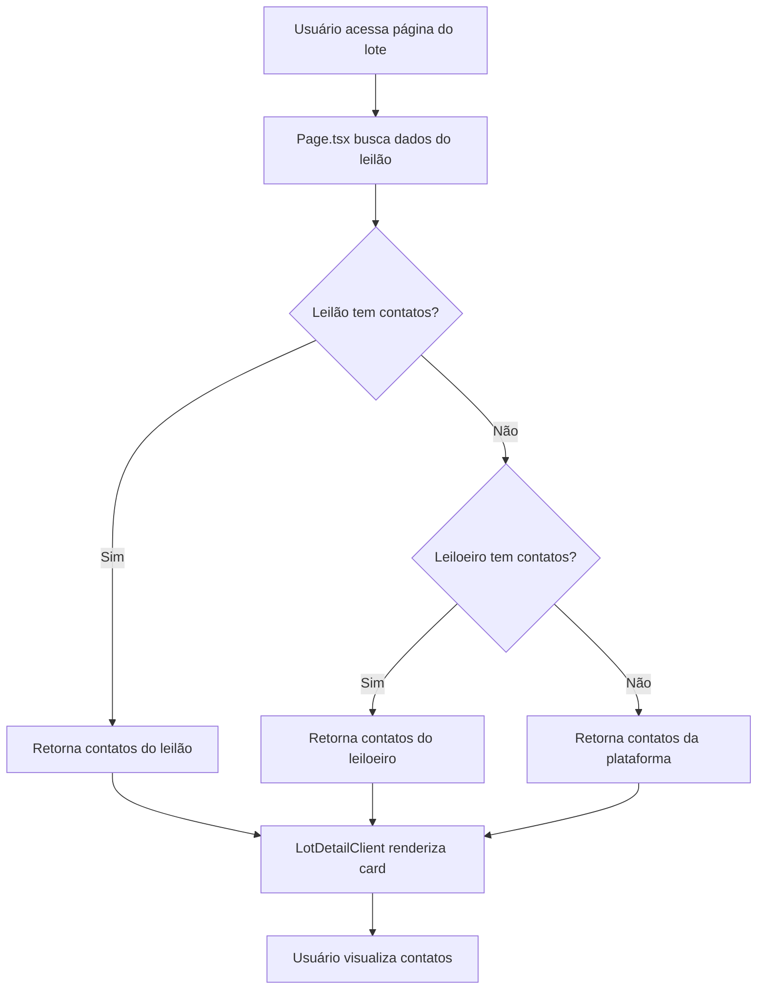

# 📞 Cadastro Hierárquico de Contatos em Leilões

## 📋 Visão Geral

Esta funcionalidade implementa um sistema hierárquico de contatos para leilões, permitindo que cada leilão tenha seus próprios contatos específicos, herde contatos do leiloeiro responsável, ou utilize contatos globais da plataforma como fallback.

## 🎯 Objetivo

Permitir que diferentes leilões exibam informações de contato apropriadas conforme a hierarquia:
1. **Prioridade 1**: Contatos específicos do leilão
2. **Prioridade 2**: Contatos do leiloeiro responsável
3. **Prioridade 3 (Fallback)**: Contatos globais da plataforma

## 🏗️ Arquitetura

### Schema Prisma

#### Model Auction
```prisma
model Auction {
  // ... campos existentes
  supportPhone     String?  @db.VarChar(50)
  supportEmail     String?  @db.VarChar(255)
  supportWhatsApp  String?  @db.VarChar(50)
}
```

#### Model Auctioneer
```prisma
model Auctioneer {
  // ... campos existentes
  email            String?  // Já existia
  phone            String?  // Já existia
  supportWhatsApp  String?  // NOVO
}
```

#### Model PlatformSettings
```prisma
model PlatformSettings {
  // ... campos existentes
  supportEmail     String?  // Já existia
  supportPhone     String?  // Já existia
  supportWhatsApp  String?  // Já existia
}
```

### Service Layer

**Arquivo**: `src/services/auction-contact.service.ts`

```typescript
export interface AuctionContactInfo {
  phone?: string | null;
  email?: string | null;
  whatsapp?: string | null;
  source: 'auction' | 'auctioneer' | 'platform';
}

// Busca contatos com lógica de herança
export async function getAuctionContact(
  prisma: PrismaClient,
  auctionId: bigint,
  tenantId: bigint
): Promise<AuctionContactInfo>

// Busca contatos de múltiplos leilões de forma eficiente
export async function getMultipleAuctionContacts(
  prisma: PrismaClient,
  auctionIds: bigint[],
  tenantId: bigint
): Promise<Map<bigint, AuctionContactInfo>>
```

### Componentes UI

**Arquivos modificados**:
1. `src/app/auctions/[auctionId]/lots/[lotId]/page.tsx` - Server-side data fetching
2. `src/app/auctions/[auctionId]/lots/[lotId]/lot-detail-client.tsx` - Client-side rendering

**Card de Contato**:
- Exibe telefone, WhatsApp e email
- Indica a origem dos contatos (leilão, leiloeiro ou plataforma)
- Links clicáveis (WhatsApp abre app, Email abre cliente de email)
- Data attributes para testabilidade (`data-ai-id`)

## 🔄 Fluxo de Dados



## 📝 BDD Scenarios

### Feature: Cadastro hierárquico de contatos em leilões

#### Scenario 1: Exibir contatos específicos do leilão
```gherkin
Given que existe um leilão com contatos próprios cadastrados
  And o leilão possui supportPhone = "+55 11 3333-4444"
  And o leilão possui supportEmail = "suporte.leilao1@bidexpert.com.br"
  And o leilão possui supportWhatsApp = "+55 11 99999-8888"
When acesso a página de detalhes de um lote desse leilão
Then devo ver o card "Contato e Suporte"
  And devo ver telefone "+55 11 3333-4444"
  And devo ver WhatsApp "+55 11 99999-8888" com link para wa.me
  And devo ver email "suporte.leilao1@bidexpert.com.br" com link mailto
  And devo ver a indicação "📋 Contato específico deste leilão"
```

#### Scenario 2: Herdar contatos do leiloeiro
```gherkin
Given que existe um leilão SEM contatos próprios
  And o leiloeiro responsável TEM contatos cadastrados
  And o leiloeiro possui phone = "+55 11 5555-6666"
  And o leiloeiro possui email = "leiloeiro@exemplo.com"
  And o leiloeiro possui supportWhatsApp = "+55 11 98888-7777"
When acesso a página de detalhes de um lote desse leilão
Then devo ver o card "Contato e Suporte"
  And devo ver os contatos do leiloeiro
  And devo ver a indicação "👤 Contato do leiloeiro - [Nome do Leiloeiro]"
```

#### Scenario 3: Fallback para contatos globais da plataforma
```gherkin
Given que existe um leilão SEM contatos próprios
  And o leiloeiro responsável NÃO tem contatos cadastrados
  And a plataforma possui supportPhone global
  And a plataforma possui supportEmail global
When acesso a página de detalhes de um lote desse leilão
Then devo ver o card "Contato e Suporte"
  And devo ver os contatos globais da plataforma
  And NÃO deve aparecer indicação de origem específica
```

#### Scenario 4: Nenhum contato disponível
```gherkin
Given que existe um leilão SEM contatos próprios
  And o leiloeiro NÃO tem contatos cadastrados
  And a plataforma NÃO tem contatos globais cadastrados
When acesso a página de detalhes de um lote desse leilão
Then devo ver o card "Contato e Suporte"
  And devo ver a mensagem "Contatos não disponíveis."
```

## 🧪 Testes

### Testes E2E (Playwright)

**Arquivo**: `tests/e2e/auction-contact-hierarchy.spec.ts`

**Testes implementados**:
1. ✅ Exibição de contatos específicos do leilão
2. ✅ Herança de contatos do leiloeiro
3. ✅ Fallback para contatos da plataforma
4. ✅ Validação de links clicáveis (WhatsApp e Email)
5. ✅ Captura de screenshot para validação visual

**Executar testes**:
```powershell
# Todos os testes de contato
npx playwright test tests/e2e/auction-contact-hierarchy.spec.ts

# Teste específico
npx playwright test tests/e2e/auction-contact-hierarchy.spec.ts -g "deve exibir contatos específicos"

# Com interface visual
npx playwright test tests/e2e/auction-contact-hierarchy.spec.ts --ui
```

### Dados de Teste (Seed)

**Arquivo**: `scripts/ultimate-master-seed.ts`

**Dados criados**:
- **Leilão 1**: Com contatos próprios (testa prioridade 1)
- **Leilão 2**: Sem contatos (herda do leiloeiro - prioridade 2)
- **Leilão 3**: Sem contatos e leiloeiro sem WhatsApp (testa fallback)
- **Auctioneers**: Com supportWhatsApp preenchido

## 🎨 Interface Admin (Próxima Etapa)

Para permitir cadastro via interface administrativa, será necessário:

1. **Formulário de edição de Leilão** (`app/admin/auctions/edit/[id]`):
   - Adicionar campos: supportPhone, supportEmail, supportWhatsApp
   - Validação de formato de telefone/email

2. **Formulário de edição de Leiloeiro** (`app/admin/auctioneers/edit/[id]`):
   - Adicionar campo: supportWhatsApp
   - Validação de formato de telefone

3. **Validações com Zod**:
```typescript
const auctionContactSchema = z.object({
  supportPhone: z.string().regex(/^\+?[1-9]\d{1,14}$/).optional(),
  supportEmail: z.string().email().optional(),
  supportWhatsApp: z.string().regex(/^\+?[1-9]\d{1,14}$/).optional(),
});
```

## 📊 Observabilidade

### Logs

O service `getAuctionContact` loga:
- Erros ao buscar contatos
- Fallback para PlatformSettings

### Métricas Sugeridas

```typescript
// Métricas a serem implementadas
{
  "auction_contact_source_distribution": {
    "auction": 45,
    "auctioneer": 30,
    "platform": 25
  },
  "auction_contact_availability": {
    "with_phone": 85,
    "with_email": 90,
    "with_whatsapp": 70,
    "no_contact": 5
  }
}
```

## 🔒 Segurança

- ✅ Validação de formato de telefones/emails (client-side e server-side)
- ✅ Sanitização de dados antes de exibir (React escapa automaticamente)
- ✅ Links seguros: `rel="noopener noreferrer"` em links externos
- ✅ Isolamento multi-tenant: sempre filtra por `tenantId`

## 📈 Performance

- ✅ Busca de contatos no SSR (Server-Side Rendering)
- ✅ Dados passados como props (sem requisição adicional no client)
- ✅ Função `getMultipleAuctionContacts` para busca em lote
- ✅ Índices no banco já existentes (auctionId, tenantId)

## 🚀 Deploy

### Checklist Pré-Deploy

- [x] Schema Prisma atualizado (MySQL e PostgreSQL)
- [x] Cliente Prisma gerado
- [x] Testes E2E criados e passando
- [x] Typecheck sem erros
- [x] Seed atualizado com dados de teste
- [ ] Migration criada e testada
- [ ] Documentação atualizada

### Migration

```powershell
# Criar migration
npx prisma migrate dev --name add_auction_contact_fields

# Aplicar em produção
npx prisma migrate deploy
```

## 📱 Responsividade

O card de contato já é responsivo:
- Mobile: Stack vertical de contatos
- Desktop: Mantém layout card padrão
- Ícones ajustados para diferentes resoluções

## ♿ Acessibilidade

- ✅ Ícones com labels semânticos
- ✅ Links com `aria-label` implícito
- ✅ Cores com contraste adequado (design system)
- ✅ Estrutura semântica HTML (Card, CardHeader, CardContent)

## 🐛 Troubleshooting

### Contatos não aparecem

1. **Verificar seed**:
```sql
SELECT id, title, supportPhone, supportEmail, supportWhatsApp 
FROM Auction 
WHERE tenantId = ?;
```

2. **Verificar service**:
```typescript
const contact = await getAuctionContact(prisma, auctionId, tenantId);
console.log('Contact source:', contact.source);
console.log('Contact data:', contact);
```

3. **Verificar props do componente**:
```tsx
console.log('auctionContact:', auctionContact);
```

### Links não funcionam

- **WhatsApp**: Verifique se o número está no formato internacional (+55...)
- **Email**: Verifique se o formato é válido

## 📚 Referências

- [Prisma Schema](https://www.prisma.io/docs/concepts/components/prisma-schema)
- [Next.js Server Components](https://nextjs.org/docs/app/building-your-application/rendering/server-components)
- [Playwright Testing](https://playwright.dev/docs/intro)
- [BDD with Gherkin](https://cucumber.io/docs/gherkin/)

## ✅ Checklist de Implementação

- [x] Adicionar campos no schema Prisma (Auction, Auctioneer)
- [x] Criar service de contatos com herança
- [x] Atualizar page.tsx para buscar contatos
- [x] Atualizar componente cliente para exibir contatos
- [x] Adicionar dados no seed
- [x] Criar testes E2E
- [x] Executar typecheck
- [x] Documentar BDD
- [ ] Criar migration
- [ ] Aplicar migration em DEV
- [ ] Executar seed em DEV
- [ ] Rodar testes E2E
- [ ] Validar visualmente no browser
- [ ] Criar PR para review
- [ ] Merge após aprovação

## 👥 Autores

- **Desenvolvedor**: GitHub Copilot AI Assistant
- **Data**: 2026-02-12
- **Versão**: 1.0.0

---

**Última atualização**: 12/02/2026
